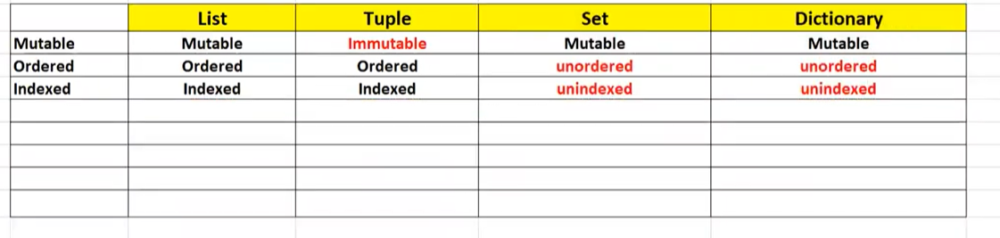

## Collections

There are four type of collections

1. List
2. Tuple
3. Set
4. Dictionary

## List

A list is a collection which is ordered and **changeable**
In python list are written with []
**List is mutable** (change, edit, remove values)

## Tuple

A tuple is a collection which is ordered and **unchangeable**
In python tuples are written with the round brackets ()
**Tuple is immutable**

if it is immutable below things are not possible

1. We can not modify existing value
2. We can not append new value
3. We can not insert a new value
4. we can not remove a value

## Set

A set is a collection which is unordered and unindexed
In python sets are written with curly brackets {}
**Set is mutable** (change, edit, remove values)

## Dictionary

Dictionary is a collection which is unordered, mutable(changeable) and indexed
In python dictionaries are written with curly brackets {}, and they have keys and values
Stores data in form of key(unique) and values(can be duplicate)

  **Key**       **Value**
product 1 :       100
product 2 :       200
product 3 :       300

