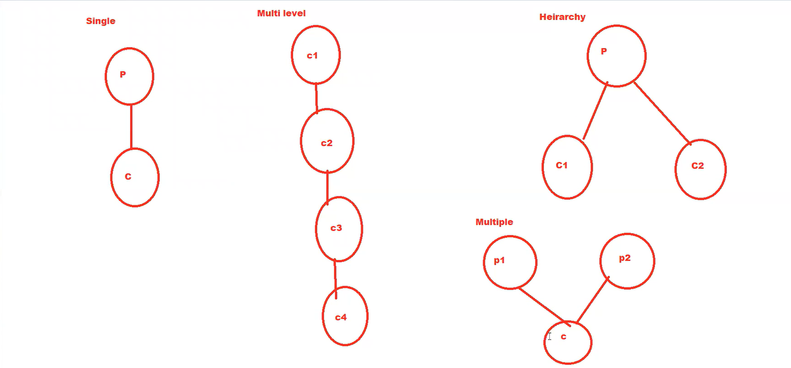

## Inheritance
Acquiring all the attributes(variables) & behavior (methods) from one class to 
another class is called as inheritance.

class A ---> a,b,c m1() m2() ----> A is parent of B class (Base class/Super class)
Class B(A) ---> x,y,z m3()  -----> B is child of A class (Sub class/derived class)

if class B object is used we can access all the variables and methods of class A also

## Objective of inheritance
1. Code re-usability
2. Avoid duplication

## Types of inheritance
1. Single - one parent and one child
2. Multi level - One parent and multiple child (each child class act as parent)
3. Hierarchy - One parent and multiple child (each child has different attributes)
4. Multiple - multiple parent one child

