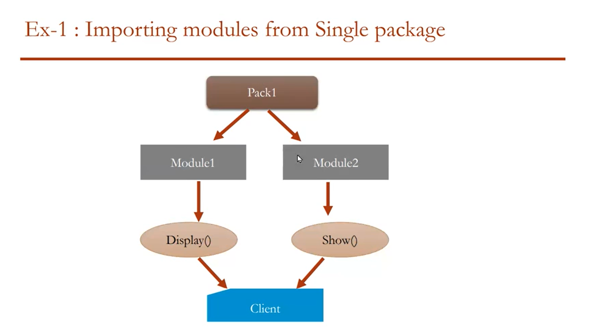

## Modules

Module - is collection of functions, classes(variables + methods)

1. How to create a module
2. How to call the functions from one module to another
3. Same functions in 2 modules

# Approach 1: Import module name
# Approach 2: from module name import functions and classes

## Packages
Collections of modules

**Package ---> Modules ---> Functions & Classes**

