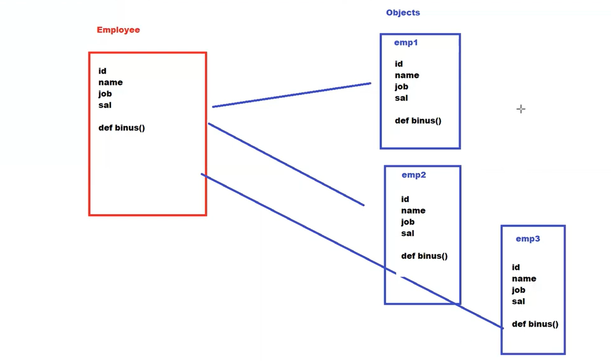

## OOPS

Object oriented programing language

1. Class - 
2. Object
3. Inheritance
4. Polymorphism

Class      Object
Employee   John, scott, harry...etc
Animal     Dog, Cat, Horse...etc

Class ----> Collection of variables(attributes) & methods (behaviour)
A class is a blueprint
logical entity
Does not occupy space in memory
ends with :

Object ----> Object is an instance of class
Physical entity
Occupy certain amount if space in memory

## Functions vs Method (terminology)

Function ---> We can create without class
Method   ---> creates inside the class

## 2 types of method within the class
1. instance method (we can call only through object)
2. static method (we can directly call using class) >>>> @staticmethod

## Method and constructor

Method: we can give any name
        method return value
        method can take arg/parameters
        we have to use an obj to invoke the method

Constructor: Name is fixed: __init__(self):
                constructor will not return any value
                constructor also take arg/parameters
                constructor will be called at the time of obj creation itself