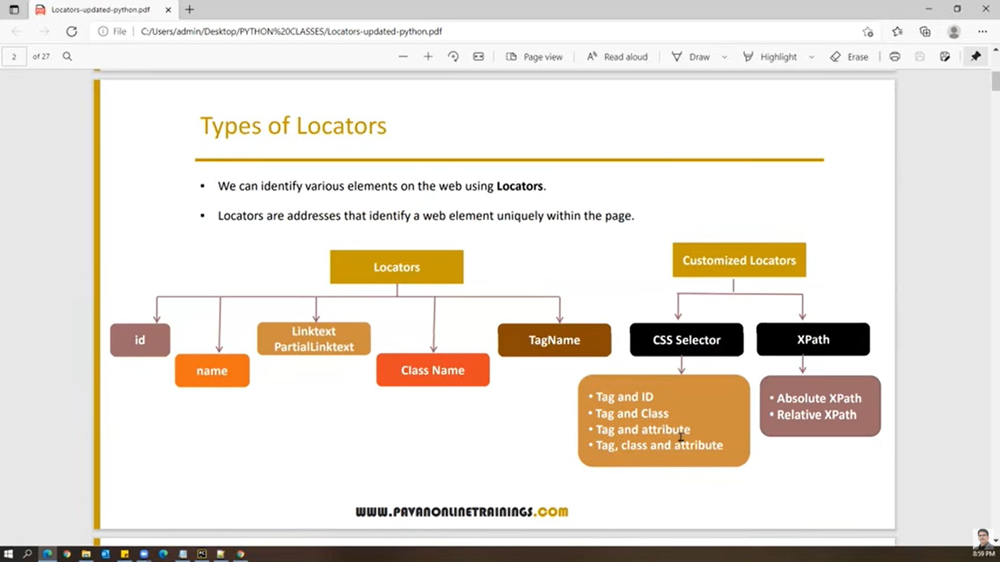

Locators

1. id
2. name
3. class
4. tag name
5. linked text
6. partial linked text
7. xpath

CSS Selectors:
1. tag & id  = **tagname # value of id**
2. tag & class = **tagname.value of class**
3. tag & attribute = tagname[attribute=value]
4. tag, class and attributes = tagname.classname[attribute=value]

Xpath:
1. Relative
2. Absolute

