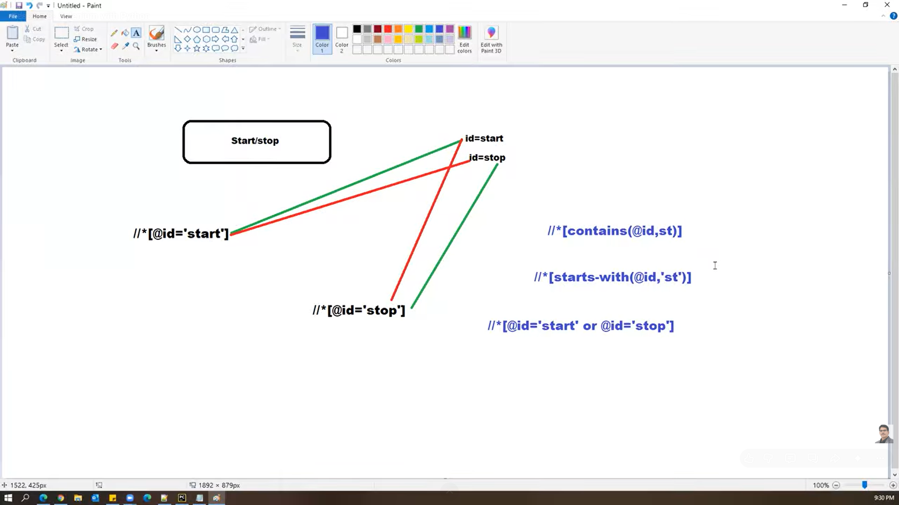

XPATH:

1. Xpath is defined as XML path
2. It is a syntax or language for finding any element on the web page using xml path expression
3. Xpath is used to fine the location of any element on a webpage using HTML DOM structure
4. Xpath can be used to navigate through elements and attributes in DOM
5. Xpath is an address of the element

Types of xpath:

1. Absolute/Full xpath
2. Relative/partial xpath

Most preferred xpath is relative xpath

XPATH options:

1. and
2. or
3. contains()
4. starts-with()
5. text()
