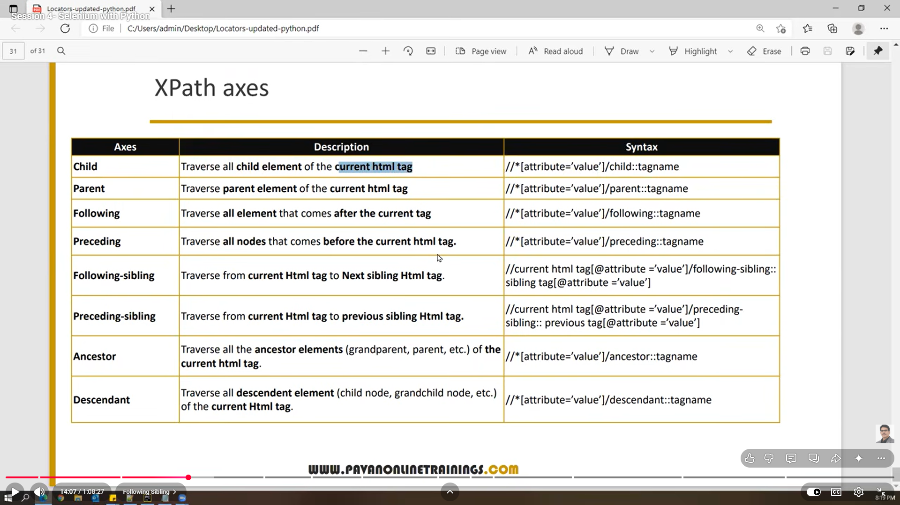
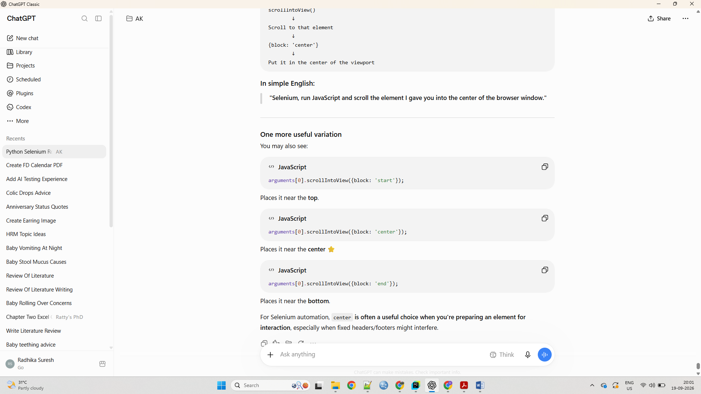

XPATH Axes:

1. Self
2. Parent
3. Child
4. Ancestor
5. Descendant
6. Following
7. Following-sibling
8. Preceding
9. Preceding-sibling
   

| Axis                  | Syntax                                                                                  |
| --------------------- | --------------------------------------------------------------------------------------- |
| **Child**             | `//*[@attribute='value']/child::tagname`                                                |
| **Parent**            | `//*[@attribute='value']/parent::tagname`                                               |
| **Following**         | `//*[@attribute='value']/following::tagname`                                            |
| **Preceding**         | `//*[@attribute='value']/preceding::tagname`                                            |
| **Following-sibling** | `//current_tag[@attribute='value']/following-sibling::sibling_tag[@attribute='value']`  |
| **Preceding-sibling** | `//current_tag[@attribute='value']/preceding-sibling::previous_tag[@attribute='value']` |
| **Ancestor**          | `//*[@attribute='value']/ancestor::tagname`                                             |
| **Descendant**        | `//*[@attribute='value']/descendant::tagname`                                           |

Important example:

    Radhika

xpath:
//span[text()='Radhika']/parent::div

To scroll the element:
