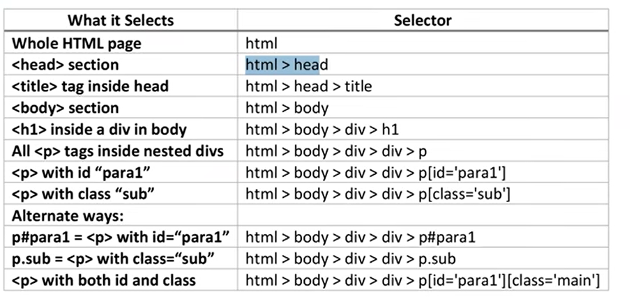
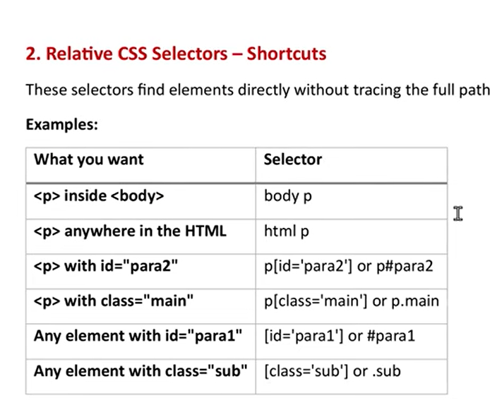
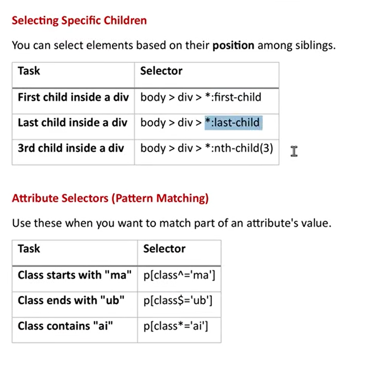
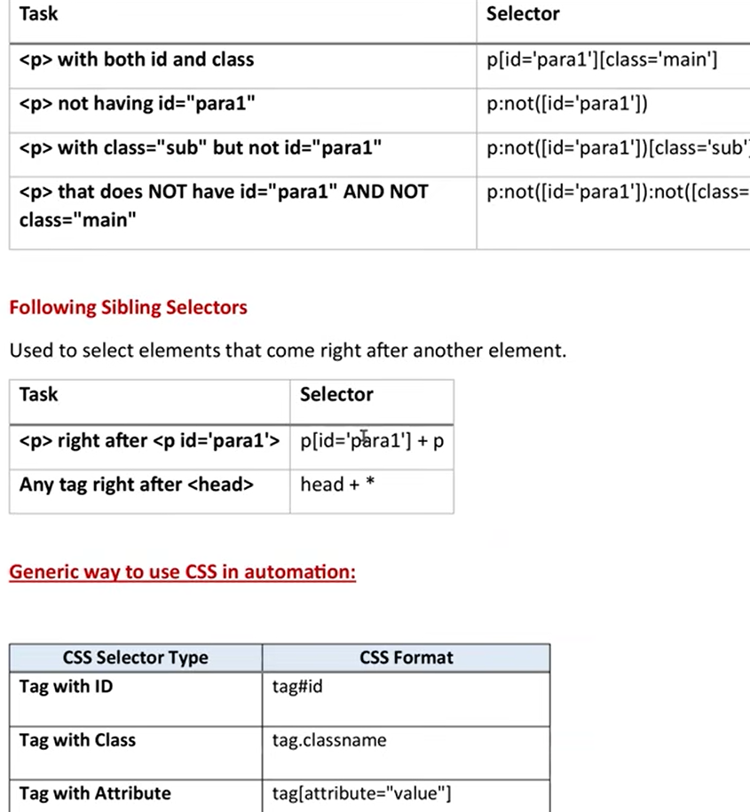
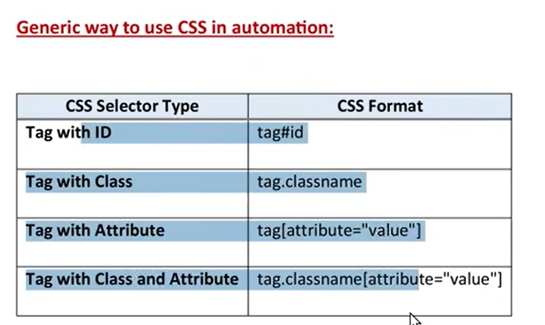

Locators

page.getByRole() to locate by explicit and implicit accessibility attributes.
page.getByText() to locate by text content.
page.getByLabel() to locate a form control by associated label's text.
page.getByPlaceholder() to locate an input by placeholder.
page.getByAltText() to locate an element, usually image, by its text alternative.
page.getByTitle() to locate an element by its title attribute.
page.getByTestId() to locate an element based on its data-testid attribute (other attributes can be configured).

